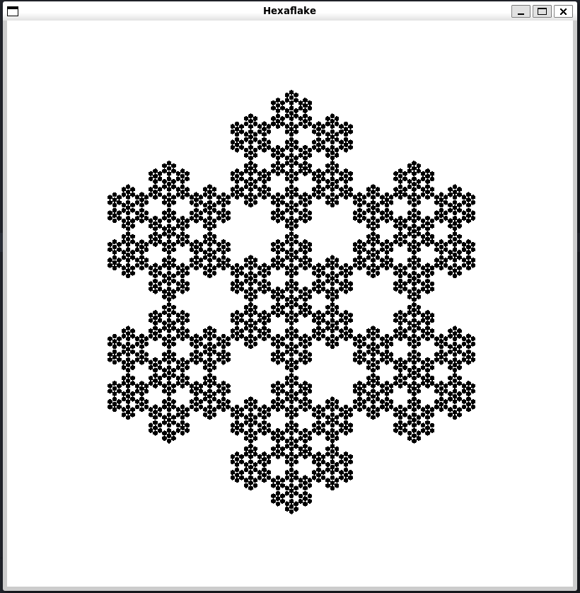

# Hexa-Fractal-Generator :snowflake:
 
created by: Brandon Nguyen



## Summary :pencil2:

A hexaflake is a type of fractal pattern characterized by the recursive subdivision of a hexagon into smaller hexagons. The process involves replacing each hexagon with a pattern of seven smaller hexagons arranged in a specific configuration. This recursive division creates an intricate and visually captivating hexagonal structure known as a hexaflake or hexagonal snowflake. The hexaflake exhibits self-similarity at different levels of magnification and is often generated using mathematical algorithms and computer programming, as seen in the provided C++ code utilizing SFML for graphical rendering.

## Features :tada:

The provided C++ code generates a hexaflake fractal pattern using the SFML library. The drawHexaflake function recursively draws hexagons with decreasing size, creating a hexagonal snowflake pattern. The main function reads user-specified parameters for the length and depth of the hexaflake from command line arguments, initializes an SFML window, and renders the hexaflake in the window. The program remains in a loop, responding to window close events, until the user closes the window. The hexaflake is drawn in black on a white background, with the initial hexagon centered at (400, -400) and subsequent hexagons forming a recursive pattern. The code is well-commented and organized, employing modular design with a separate header file for function declarations.

## Build :hammer_and_wrench:

Clone the repository:

```
git clone https://github.com/ThatGuyHieu/Hexa-Fractal-Generator.git
cd Hexa-Fractal-Generator
make
```

## Run :runner:

```
./Hexa [Size] [Depth]
```